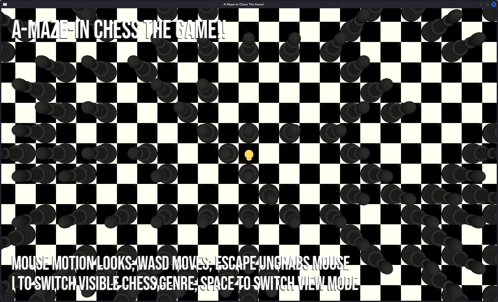
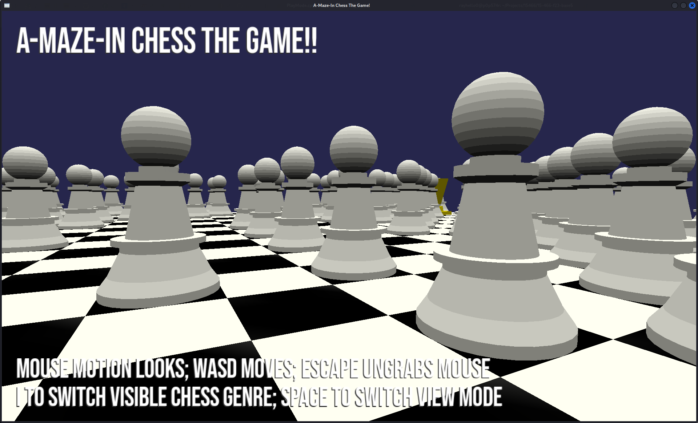

# A-Maze-in Chess The Game!! 

Author: Sirui Huang, Sizhe Chen (We each will find new teammates for game 6!)

Design: Chess is fun! But believe me, it will be more fun if it's not (just) chess... 

Navigate through a chess-themed maze! Everything might all seem normal at first, but you will soon bump into seemingly nothing and have your movements restricted. When this happens, **press I to see the unseeable!** You can only see chess pieces of one color at a time. Also, to better see what's ahead of you, **press Space to switch to world view**. After getting a better sense of what's going on, **press space again to switch back to first person view** to have better control of your movements and directions.

(NOTE: This maze is solvable! If you get stuck, check maze.PNG for some ideas. There are paths that you can squeeze through.)

Screen Shots:

How To Play:
There are two perspective modes. Press Space to switch between the modes.
- First person mode: WASD to move; Mouse motion to look around; 
- Map view mode: WASD moves.

Escape ungrabs mouse. **I to toggle black/white chess visibility.** Press R to restart.

Sources: 
- Font--https://fonts.google.com/specimen/Bebas+Neue.
- Music--Sirui Huang (HHHhhh_play on music platforms).

This game was built with [NEST](NEST.md).

